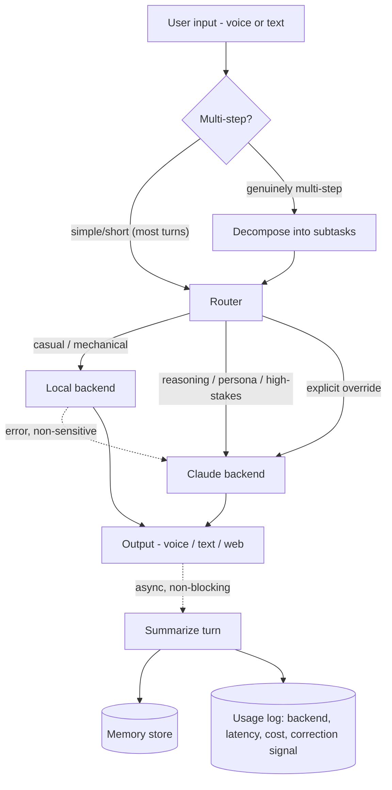

# Kyra agentic roadmap

Duc's prioritized use-case notes, organized, routed against `docs/model-benchmark.md`, and answered. Interactive version (collapsible implementation notes) published as an artifact; this is the durable copy.

## TurnRouter — built, wired in, verified (2026-09-02)

The design Duc worked through across several sessions is now real code, not just a plan. `src/companion/router.py`: explicit override phrase ("ask claude"/"use local") → sticky session mode (`session_state.py`, file-backed, shared across all three front doors, focus→claude/chill→local) → a small local classifier (Llama-3.2-3B, separate from the conversational local model) deciding text-vs-tool and claude-vs-local. Tool path always goes to Claude as the "Agent Specialist" via a real Anthropic tool-use loop (`AnthropicLLM.respond_with_tools()`). Long/multi-part input biases to Claude rather than being decomposed into subtasks (that stayed out of scope, per the effort estimate). Every decision logged to `data/router.log` (JSONL) with a reason. Wired into `chat.py`, `voice_chat.py`, and the web UI (three-way AUTO/CLAUDE/LOCAL toggle, each with its own accent color, live routing badge on each reply in auto mode).

Verified with real calls, not mocked: classifier correctly separates tool vs. text-claude vs. text-local (7/7 after one prompt-tuning pass — see the two real bugs it caught, below); override phrases and session modes force the right backend; a real multi-turn `chat.py` session added and recalled a reminder and pulled live tech news through actual tool calls; same flows re-verified through the running web UI via real browser interaction.

Two real bugs found and fixed while building this, not just theoretical risks:
1. **Tool-calling needs a bigger token budget than plain chat.** Sonnet 5's adaptive thinking eats into `max_tokens`, and the original shared 500-token budget got exhausted mid-thinking on a real tool-calling turn, before it ever reached a tool call — silently returning an empty reply. Fixed with a separate `tool_max_tokens` (2000) and explicit handling of `stop_reason == "max_tokens"` as a failure, not silence.
2. **The classifier's first prompt version missed real tool calls, then over-corrected into hallucinating ones.** Without concrete examples, "what's the tech news today" was read correctly in spirit (its own stated reason understood the intent) but classified with the wrong `path` field. Adding examples fixed that, but then "draft a cover letter" (no matching tool exists) got misclassified as a tool call too. Fixed with an explicit "task-shaped isn't tool-shaped unless it matches something listed" instruction plus negative examples. Small local models are this sensitive to prompt wording — re-test a mixed batch, not just the one case being fixed, after any change to `CLASSIFIER_PROMPT`.

## Memory Notes — built, wired in, verified (2026-09-03)

A second, separate memory layer, from Duc's own research into "company brain" AI-memory projects (GBrain, Mem0, Letta, Zep/Graphiti, Sylph, the DIY Claude+git+markdown pattern) - not one of the eight jobs below, a standalone addition. `src/companion/memory_notes.py`: `MemoryNotesStore` ABC → `MarkdownMemoryNotesStore`, one Markdown file per category (`data/memory_notes/<category>.md`, e.g. `people.md`/`preferences.md`/`projects.md`), each note an append-only, dated bullet - human-readable and git-diffable on purpose, not a vector DB entry.

The key idea this borrows from Mem0: separate curated, durable facts from raw conversation logging. `ChromaMemoryStore` (job #3) already logs every exchange and retrieves the top-k semantically similar ones per turn - good for "what did we just talk about," but a fact can be relevant right now without being semantically similar to the current message, and top-k retrieval can just miss it. Memory Notes is the other half: a small set of facts Claude itself decides are worth saving (`save_memory_note` tool, not automatic), loaded into the system prompt **in full, every turn** (`ConversationManager._build_system()`), not search-retrieved - the two layers sit side by side in the prompt, "durable facts" above "relevant things you remember from past conversations."

Temporal handling is deliberately simplified relative to Zep/Graphiti's point-in-time graph - append-only dated lines, "most recent wins" is a reading convention, not code that resolves contradictions. Documented in the module docstring as a real, intentional simplification (small curated fact count keeps it useful), not something to silently "fix" into pruning history.

`router.py`'s `CLASSIFIER_PROMPT` got few-shot examples for `save_memory_note` too (explicit "remember that..."/"make a note that..." phrasing → tool; a casual mention of the same fact with no save request → text/local, tested explicitly so the classifier doesn't over-trigger on every personal statement). Verified: unit tests on `MarkdownMemoryNotesStore` (add/render, multiple categories, most-recent-wins ordering, empty-note rejection); a real Claude tool-calling turn through `ConversationManager` that saved a preference and correctly rendered it back into the next system prompt; classifier re-tested against a mixed batch - all 8 new cases (4 explicit-save, 1 casual-mention negative, plus reused job-app cases) correct, no regression on the existing suite.

## Queued for later

- ~~Router/agent-specialist model benchmark~~ — **done, 2026-09-02, see `docs/router-model-benchmark.md`.** Headline: `Llama-3.2-3B` stays the classifier default (96.6% accuracy after a real prompt-bug fix this benchmark caught), and Qwen2.5-7B was flawless as a local tool-caller on an 11-case suite - promising but not yet enough to move the Agent Specialist role off Claude (small suite, needs harder ambiguous/multi-tool cases first).
- **Real subtask decomposition/execution** — today "complex" input just biases routing toward Claude in one call; actually splitting into subtasks and running them (possibly across multiple tool/model calls) was scoped out as a separate, bigger feature.
- **Background/threaded turns** — deferred per the effort estimate given earlier (text/web version: hours; voice version: days, mostly UX judgment, not code).

## The eight jobs, in priority order

| # | Job | Route | Status |
|---|---|---|---|
| 1 | Work coordination / Claude Code handoff | Claude | Building tonight (draft-only, no execution) |
| 2 | Reminder + Planner | Local | Building tonight |
| 3 | Normal talk (casual chat) | Local | Building tonight — memory recall upgrade |
| 4 | Job Application Auto | Claude (drafting only) | Built (2026-09-03) — tracker + two-pass draft assistant, both. Hard boundary holds: no auto-submission, ever. |
| 5 | Daily Tech News | Local | Building tonight — RSS-based, not scraped |
| 6 | Quick question | Router, per-question | No build needed — already works via `chat.py`/`voice_chat.py` |
| 7 | Learning reels / book summaries | Claude | Built (2026-09-02) — spaced-repetition review loop |
| 8 | Science facts | Local | Built (2026-09-02) — RSS, same shape as news |

### 1. Work coordination — Claude Code / Codex handoff
Draft-only per Duc's choice: Kyra composes a structured task brief (goal, context, constraints, acceptance criteria) from the conversation + memory, saves it to `handoff/latest_task.md`, and copies it to the clipboard (`pbcopy`) for Duc to paste into Claude Code himself. No execution. Actually launching a `claude` session is a later step that needs explicit guardrail decisions first (confirmation before running, how output gets back to Kyra).

### 2. Reminder + Planner
SQLite-backed (stdlib `sqlite3`, no new dependency): `id, text, due_at, created_at, done`. Tool methods: `add_reminder`, `list_reminders`, `complete_reminder`, `snooze_reminder`. Kyra can proactively mention due items at session start. Push notifications need a background scheduler (`launchd`/cron) — separate future work, not tonight.

### 3. Normal talk
Local is exactly the case the benchmark validated as "good enough" — the gap to close is retrieval quality, not model choice:
- Swap Chroma's generic default embedding for `all-MiniLM-L6-v2` or `bge-small-en-v1.5` via the existing `embedding_function` hook on `ChromaMemoryStore` — free, local, ~80–130 MB.
- Add recency weighting: `score = 0.7·similarity + 0.3·recency_decay` — casual chat leans on "what we just talked about" more than pure semantic match.
- Later: periodically summarize old sessions into compact profile facts instead of storing every raw exchange forever.

### 4. Job Application Auto — built, wired in, verified (2026-09-03)
**The boundary is submit, not fill - re-decided explicitly with Duc, not silently expanded.** The original scope note said "nothing fills in or submits a real form"; Duc explicitly asked for autofill next (motivated by keeping his info local instead of handing it to a commercial extension like Simplify/LazyApply, and by wanting fewer manual steps once he starts crawling postings himself). Submission stays off-limits - every fill run leaves a real, visible browser window open for Duc to review and submit himself, and nothing in this codebase clicks that button.

- **Tracker** (`JobApplicationStore`, SQLite): `add_job_application`, `list_job_applications` (optional status filter), `update_job_application_status` (applied/interviewing/offer/rejected/withdrawn).
- **Draft assistant** (`draft_application_material`): two-pass generation - draft, then a critique-and-rewrite pass using the actual methodology from [github.com/blader/humanizer](https://github.com/blader/humanizer) (MIT), which Duc surfaced from his own research: 35 AI-writing patterns (from Wikipedia's WikiProject AI Cleanup) across content/language/chatbot-hedging categories, plus a four-step process ending in a self-check ("does this still sound AI? did any fact change?"). Reworded for job-application material, not copied verbatim. Never invents facts - a name, number, date, or claim has to come from what Duc actually gave it.
- **Autofill** (`autofill_job_application`, `src/companion/job_autofill.py`) - fills a Greenhouse application form from Duc's local `ApplicantProfile` (`src/companion/profile.py`, a single local JSON record, never sent anywhere except into a form field on a page Duc asked to fill). Built via Playwright, targeting **fill only** - the browser window stays open, nothing auto-submits. Design grounded in a real live Greenhouse posting (a public Affirm job, inspected live, no data entered/submitted), not guessed structure:
  - Core fields (name/email/phone/country/resume/cover-letter/LinkedIn/GitHub/portfolio) and EEO voluntary self-ID fields (gender identity, race/ethnicity, veteran/disability status) are consistently labeled across every Greenhouse-hosted company - matched by label text and filled directly. EEO fields default to "Decline to self-identify" unless Duc sets real answers - never guessed.
  - Custom questions (referral source, "worked here before?", pronouns, etc.) vary per posting and are never guessed - unmatched fields are explicitly reported as skipped, not silently left blank without a trace.
  - Every run writes a Markdown summary to `data/job_autofill_logs/` listing exactly what was filled and what was skipped and why - the "easily checked and read" requirement Duc asked for, not an afterthought.
  - One real bug caught during build: Greenhouse renders purely numeric HTML ids (e.g. `id="4028768003"`), which are invalid as bare CSS `#id` selectors (a CSS identifier can't start with a digit) - fixed by matching on `[id="..."]` attribute syntax instead.
  - Verified end-to-end against the real live Affirm posting used for design (headless, obviously-fake placeholder data, never submitted): 13-14 fields filled correctly per run including the resume file attach, all EEO fields safely defaulted, and every genuinely custom question correctly skipped with a clear reason rather than guessed.
- Wired into `default_tool_registry()` (`src/companion/default_tools.py`) with a dedicated `AnthropicLLM` instance at `max_tokens=1500` for drafting - the same tool-calling token-budget lesson from the router build (job #1 above) applies here too: a cover letter draft plus a critique pass needs real room, not the 500-token chat default.
- `router.py`'s `CLASSIFIER_PROMPT` updated with few-shot examples for all five tools (add/list/update-status/draft/autofill), replacing the now-stale "draft a cover letter → text/claude, no matching tool" example from before these tools existed. Re-tested against a mixed batch per the standing rule after each edit - one real regression caught and fixed along the way (adding the autofill examples flipped an already-passing memory-note case; fixed by adding that exact phrasing as its own example, then re-verified clean).
- **Still queued**: Lever/Workday/iCIMS adapters (each is its own selector set, not a generalization of Greenhouse's), and the later job-posting-crawling phase (Greenhouse and Lever both expose public job-board APIs, worth using before falling back to scraping - same "RSS not scraping" reasoning as `news.py`).

### 5. Daily Tech News
Not scraping NYTimes — fragile, ToS-risk, paywalled. RSS instead: NYT Technology RSS (official, free), Hacker News (official API), TechCrunch/Ars Technica/The Verge RSS. A `NewsTool` pulls, dedupes, and Kyra summarizes the top N into a spoken-friendly briefing. On-demand tonight; scheduled daily push bundles with the reminders scheduler work later.

### 6. Quick question
Already works today — this is purely a `TurnRouter` decision (trivia → local, anything relied-on → Claude), not a new subsystem.

### 7. Learning reels / book summaries — built
Claude for the summary itself (structured synthesis is where local's biggest gap was: 1.6–3.0 vs 4.25–5.0 on the benchmark's reasoning tasks) — and the summary is never tool-generated content, it's just Claude answering normally; the tool (`learning.py`) only persists and schedules what Claude wrote. "Remember and apply" = spaced repetition, same mechanism as Anki: resurface each learned item at 1/3/7 days after the last *successful* review, reset to 1 day on a forgotten one. Streak counts once per calendar day (reviewing 5 things today isn't 5x streak), verified with a real Claude tool-call session that summarized the CAP theorem correctly and saved it with a genuinely useful key takeaway. Reward system stays a plain streak Kyra can mention conversationally — visible gamification deliberately not built yet.

**Extended, 2026-09-02: reading whole books.** `scripts/summarize_book.py` + `book_reader.py` - point it at a PDF or EPUB, it extracts the text, Claude writes a structured summary + key takeaway (300-500 words, whole-book context - Sonnet 5's 1M-token window fits nearly any real book in one call, no chunking needed), and it saves straight into the same spaced-repetition store. A standalone script, not a conversational tool - summarizing a whole book has a real cost and shouldn't be one ambiguous voice command away. Verified end-to-end on a real public-domain book (Project Gutenberg, both EPUB and PDF extraction paths) - accurate summary, correct key takeaway, correct scheduling. Sourcing the book file itself is entirely Duc's call - legitimate options (university library O'Reilly access, Perlego, public library apps, Internet Archive) discussed inline in chat, not reproduced here.

### 8. Science facts — built
Same shape as Daily News, and literally shares its fetch/parse code now (`feeds.py`, extracted from `news.py`) — RSS from NYT Science, ScienceDaily, Phys.org, NASA, all verified live. Not model-generated facts, to avoid the "confidently invents one" risk called out originally.

## Q1 — Which tasks go to which model?

Table above; grounded in `docs/model-benchmark.md`'s actual per-dimension scores, not a guess. Reasoning/persona/hallucination-sensitive work → Claude. Mechanical, casual, or given-context-only work → local.

## Q2 — Cost to train a model: is it worth it?

| Approach | Time | Cost | Verdict |
|---|---|---|---|
| Pretrain from scratch | weeks–months, clusters | tens of thousands–millions $ | Not for an individual |
| Full fine-tune (all weights) | hours–a day, big GPU | ~$50–300 cloud (won't fit 36 GB comfortably) | Skip — LoRA gets ~90% of the benefit far cheaper |
| **LoRA / QLoRA fine-tune** | 1–6 hours | **$0 on the M5 Max via MLX-LM**, or ~$5–30 cloud | **Worth it** |
| DPO (preference tuning) | similar to LoRA | ~$0–30 | Worth it, once there's thumbs-up/down data |

**Verdict**: LoRA on the M5 Max is worth trying — marginal cost is ~$0 and an evening. The real blocker isn't cost, it's *data*: a useful persona/style fine-tune wants a few hundred to a few thousand real example exchanges, which don't exist yet. Use the system-prompt version for a few weeks, export the good conversations, then fine-tune. Also the better interview story: "identified when fine-tuning made sense vs. prompting," not "trained a model with no data behind it."

## Q3 — How to make the pipeline more professional

Duc's sketch (decompose → router → API/local → output → summarize → save-for-reference-or-error-tracking) is a solid instinct. Six refinements:

1. **Conditional decomposition, not universal.** Decomposing every turn adds a full extra LLM round-trip before simple turns even start. Only decompose when a cheap check (or the router) flags something genuinely multi-step.
2. **Observable router.** Log the decision + a one-line reason every time — an unauditable router is a black box, not professional.
3. **Retry/timeout/fallback around execution.** Local error on a non-sensitive turn → fall back to Claude silently instead of surfacing a raw error.
4. **Async summarize-for-memory.** Don't block the next turn on memory bookkeeping.
5. **One unified turn log**, not two separate ideas: backend used, latency, and a cheap quality signal (did the user immediately rephrase/repeat — a sign the answer missed). This log doubles as the DPO training data from Q2.
6. **Config over hardcoding.** The keybinding request is this instinct already — generalize it: backend defaults, routing thresholds, news feeds, all in one config file.

Keep using `docs/model-benchmark.md` as a living regression suite — rerun it whenever the router, prompts, or models change.

## The refined flow

## Tonight's build — done

- [x] `Tool` interface + registry (`src/companion/tools.py`) — schemas map 1:1 onto Claude's tool-use format
- [x] Reminder / Planner tool (`src/companion/reminders.py`) — SQLite, 4 tools, tested end-to-end
- [x] Daily Tech News tool (`src/companion/news.py`) — real RSS/Atom fetches verified against all 5 live feeds
- [x] Memory recall upgrade (`src/companion/memory.py`) — BGE embedding + recency weighting; existing memories migrated (`scripts/migrate_memory_embeddings.py`), verified via real retrieval queries
- [x] Configurable voice keybindings (`src/companion/keybindings.py`) — PTT + interrupt, verified with real pty tests (not just piped stdin)
- [x] Claude Code handoff, draft-only (`src/companion/handoff.py`) — tested with a real Claude call producing a real, non-hallucinated task brief

**Update, 2026-09-02: now wired in.** These tools sat independently-tested-but-unused for one day, then got connected for real once the `TurnRouter` above landed — see that section. Also caught and fixed one real bug along the way that night: raw-keypress reading on non-interactive stdin was busy-looping instead of failing cleanly — see CLAUDE.md.
