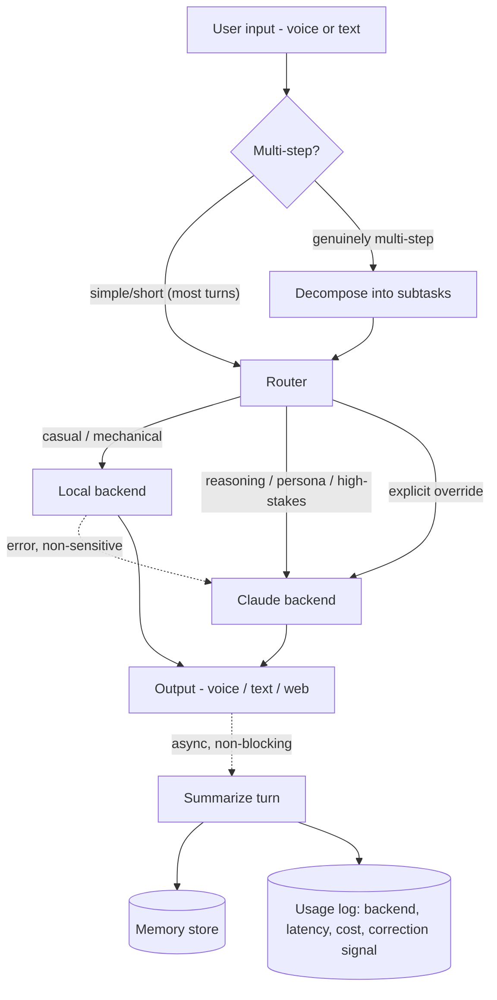

# Kyra agentic roadmap

Duc's prioritized use-case notes, organized, routed against `docs/model-benchmark.md`, and answered. Interactive version (collapsible implementation notes) published as an artifact; this is the durable copy.

## TurnRouter — built, wired in, verified (2026-09-02)

The design Duc worked through across several sessions is now real code, not just a plan. `src/companion/router.py`: explicit override phrase ("ask claude"/"use local") → sticky session mode (`session_state.py`, file-backed, shared across all three front doors, focus→claude/chill→local) → a small local classifier (Llama-3.2-3B, separate from the conversational local model) deciding text-vs-tool and claude-vs-local. Tool path always goes to Claude as the "Agent Specialist" via a real Anthropic tool-use loop (`AnthropicLLM.respond_with_tools()`). Long/multi-part input biases to Claude rather than being decomposed into subtasks (that stayed out of scope, per the effort estimate). Every decision logged to `data/router.log` (JSONL) with a reason. Wired into `chat.py`, `voice_chat.py`, and the web UI (three-way AUTO/CLAUDE/LOCAL toggle, each with its own accent color, live routing badge on each reply in auto mode).

Verified with real calls, not mocked: classifier correctly separates tool vs. text-claude vs. text-local (7/7 after one prompt-tuning pass — see the two real bugs it caught, below); override phrases and session modes force the right backend; a real multi-turn `chat.py` session added and recalled a reminder and pulled live tech news through actual tool calls; same flows re-verified through the running web UI via real browser interaction.

Two real bugs found and fixed while building this, not just theoretical risks:
1. **Tool-calling needs a bigger token budget than plain chat.** Sonnet 5's adaptive thinking eats into `max_tokens`, and the original shared 500-token budget got exhausted mid-thinking on a real tool-calling turn, before it ever reached a tool call — silently returning an empty reply. Fixed with a separate `tool_max_tokens` (2000) and explicit handling of `stop_reason == "max_tokens"` as a failure, not silence.
2. **The classifier's first prompt version missed real tool calls, then over-corrected into hallucinating ones.** Without concrete examples, "what's the tech news today" was read correctly in spirit (its own stated reason understood the intent) but classified with the wrong `path` field. Adding examples fixed that, but then "draft a cover letter" (no matching tool exists) got misclassified as a tool call too. Fixed with an explicit "task-shaped isn't tool-shaped unless it matches something listed" instruction plus negative examples. Small local models are this sensitive to prompt wording — re-test a mixed batch, not just the one case being fixed, after any change to `CLASSIFIER_PROMPT`.

## Queued for later

- **Router/agent-specialist model benchmark** — a different question from `docs/model-benchmark.md`'s conversational-quality rubric. Two narrower jobs to benchmark separately: (1) the router's own classifier — fast/cheap/local, judged on classification accuracy + latency, not chat quality, candidates as small as Qwen2.5-0.5B/1.5B or Llama-3.2-1B (currently Llama-3.2-3B, untuned against alternatives); (2) an "agent specialist" for tool coordination — judged on correct tool selection, correctly-formatted arguments, not over-triggering, and multi-tool sequences, needs its own task suite (given N tool schemas + a request, check what actually gets called). Hold until Duc asks for it.
- **Job Application Auto scoping** — tracker vs. draft assistant vs. both, still needs Duc's pick (see job #4 below). Full auto-submission stays out of scope regardless.
- **Real subtask decomposition/execution** — today "complex" input just biases routing toward Claude in one call; actually splitting into subtasks and running them (possibly across multiple tool/model calls) was scoped out as a separate, bigger feature.
- **Background/threaded turns** — deferred per the effort estimate given earlier (text/web version: hours; voice version: days, mostly UX judgment, not code).

## The eight jobs, in priority order

| # | Job | Route | Status |
|---|---|---|---|
| 1 | Work coordination / Claude Code handoff | Claude | Building tonight (draft-only, no execution) |
| 2 | Reminder + Planner | Local | Building tonight |
| 3 | Normal talk (casual chat) | Local | Building tonight — memory recall upgrade |
| 4 | Job Application Auto | Claude (drafting only) | Hard boundary: no auto-submission, ever. Tracker/draft scoping needs Duc's pick. |
| 5 | Daily Tech News | Local | Building tonight — RSS-based, not scraped |
| 6 | Quick question | Router, per-question | No build needed — already works via `chat.py`/`voice_chat.py` |
| 7 | Learning reels / book summaries | Claude | Designed, not built — spaced-repetition review loop |
| 8 | Science facts | Local | Designed, not built — same shape as news |

### 1. Work coordination — Claude Code / Codex handoff
Draft-only per Duc's choice: Kyra composes a structured task brief (goal, context, constraints, acceptance criteria) from the conversation + memory, saves it to `handoff/latest_task.md`, and copies it to the clipboard (`pbcopy`) for Duc to paste into Claude Code himself. No execution. Actually launching a `claude` session is a later step that needs explicit guardrail decisions first (confirmation before running, how output gets back to Kyra).

### 2. Reminder + Planner
SQLite-backed (stdlib `sqlite3`, no new dependency): `id, text, due_at, created_at, done`. Tool methods: `add_reminder`, `list_reminders`, `complete_reminder`, `snooze_reminder`. Kyra can proactively mention due items at session start. Push notifications need a background scheduler (`launchd`/cron) — separate future work, not tonight.

### 3. Normal talk
Local is exactly the case the benchmark validated as "good enough" — the gap to close is retrieval quality, not model choice:
- Swap Chroma's generic default embedding for `all-MiniLM-L6-v2` or `bge-small-en-v1.5` via the existing `embedding_function` hook on `ChromaMemoryStore` — free, local, ~80–130 MB.
- Add recency weighting: `score = 0.7·similarity + 0.3·recency_decay` — casual chat leans on "what we just talked about" more than pure semantic match.
- Later: periodically summarize old sessions into compact profile facts instead of storing every raw exchange forever.

### 4. Job Application Auto
**Hard boundary, not a preference**: filling in and submitting real application forms is off-limits to automate. In scope: an application tracker (company/role/link/status/notes, with follow-up nudges) and/or a draft assistant (paste a posting, Kyra drafts a tailored paragraph from stored background, Duc reviews and submits himself). Needs Duc's pick on which (or both) before building.

### 5. Daily Tech News
Not scraping NYTimes — fragile, ToS-risk, paywalled. RSS instead: NYT Technology RSS (official, free), Hacker News (official API), TechCrunch/Ars Technica/The Verge RSS. A `NewsTool` pulls, dedupes, and Kyra summarizes the top N into a spoken-friendly briefing. On-demand tonight; scheduled daily push bundles with the reminders scheduler work later.

### 6. Quick question
Already works today — this is purely a `TurnRouter` decision (trivia → local, anything relied-on → Claude), not a new subsystem.

### 7. Learning reels / book summaries
Claude for the summary itself (structured synthesis is where local's biggest gap was: 1.6–3.0 vs 4.25–5.0 on the benchmark's reasoning tasks). "Remember and apply" = spaced repetition, same mechanism as Anki: resurface each learned item at 1/3/7 days. Reward system starts as a plain streak Kyra mentions conversationally — hold off on visible gamification until the core loop's been used for a week.

### 8. Science facts
Same shape as Daily News — a science RSS feed, or model-generated facts with a quick verification pass so it doesn't confidently invent one.

## Q1 — Which tasks go to which model?

Table above; grounded in `docs/model-benchmark.md`'s actual per-dimension scores, not a guess. Reasoning/persona/hallucination-sensitive work → Claude. Mechanical, casual, or given-context-only work → local.

## Q2 — Cost to train a model: is it worth it?

| Approach | Time | Cost | Verdict |
|---|---|---|---|
| Pretrain from scratch | weeks–months, clusters | tens of thousands–millions $ | Not for an individual |
| Full fine-tune (all weights) | hours–a day, big GPU | ~$50–300 cloud (won't fit 36 GB comfortably) | Skip — LoRA gets ~90% of the benefit far cheaper |
| **LoRA / QLoRA fine-tune** | 1–6 hours | **$0 on the M5 Max via MLX-LM**, or ~$5–30 cloud | **Worth it** |
| DPO (preference tuning) | similar to LoRA | ~$0–30 | Worth it, once there's thumbs-up/down data |

**Verdict**: LoRA on the M5 Max is worth trying — marginal cost is ~$0 and an evening. The real blocker isn't cost, it's *data*: a useful persona/style fine-tune wants a few hundred to a few thousand real example exchanges, which don't exist yet. Use the system-prompt version for a few weeks, export the good conversations, then fine-tune. Also the better interview story: "identified when fine-tuning made sense vs. prompting," not "trained a model with no data behind it."

## Q3 — How to make the pipeline more professional

Duc's sketch (decompose → router → API/local → output → summarize → save-for-reference-or-error-tracking) is a solid instinct. Six refinements:

1. **Conditional decomposition, not universal.** Decomposing every turn adds a full extra LLM round-trip before simple turns even start. Only decompose when a cheap check (or the router) flags something genuinely multi-step.
2. **Observable router.** Log the decision + a one-line reason every time — an unauditable router is a black box, not professional.
3. **Retry/timeout/fallback around execution.** Local error on a non-sensitive turn → fall back to Claude silently instead of surfacing a raw error.
4. **Async summarize-for-memory.** Don't block the next turn on memory bookkeeping.
5. **One unified turn log**, not two separate ideas: backend used, latency, and a cheap quality signal (did the user immediately rephrase/repeat — a sign the answer missed). This log doubles as the DPO training data from Q2.
6. **Config over hardcoding.** The keybinding request is this instinct already — generalize it: backend defaults, routing thresholds, news feeds, all in one config file.

Keep using `docs/model-benchmark.md` as a living regression suite — rerun it whenever the router, prompts, or models change.

## The refined flow

## Tonight's build — done

- [x] `Tool` interface + registry (`src/companion/tools.py`) — schemas map 1:1 onto Claude's tool-use format
- [x] Reminder / Planner tool (`src/companion/reminders.py`) — SQLite, 4 tools, tested end-to-end
- [x] Daily Tech News tool (`src/companion/news.py`) — real RSS/Atom fetches verified against all 5 live feeds
- [x] Memory recall upgrade (`src/companion/memory.py`) — BGE embedding + recency weighting; existing memories migrated (`scripts/migrate_memory_embeddings.py`), verified via real retrieval queries
- [x] Configurable voice keybindings (`src/companion/keybindings.py`) — PTT + interrupt, verified with real pty tests (not just piped stdin)
- [x] Claude Code handoff, draft-only (`src/companion/handoff.py`) — tested with a real Claude call producing a real, non-hallucinated task brief

**Update, 2026-09-02: now wired in.** These tools sat independently-tested-but-unused for one day, then got connected for real once the `TurnRouter` above landed — see that section. Also caught and fixed one real bug along the way that night: raw-keypress reading on non-interactive stdin was busy-looping instead of failing cleanly — see CLAUDE.md.
