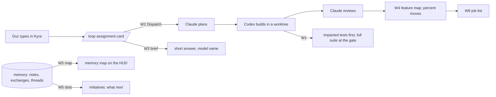

# Plan: Kyra as the front door, and the six asks of 2026-09-16

Duc's message, reduced: two corrections to how Claude manages, then six asks. Everything below is a
table or a map on purpose. Claude Fable 5.1 plans, writes red tests and reviews; Codex builds.

## Corrections, in effect from now

| Before | Now |
|---|---|
| Claude waited for the desktop Codex task to wake | Any pending build is launched by Claude through `codex exec` at once, on its branch |
| A red CI on a red-tests PR was explained | It is assigned: the build that turns it green starts immediately, then review |

## The six asks

| Id | Ask | Smallest useful slice | Gate |
|---|---|---|---|
| W1 | Test impact analysis (the Anthropic post) | A results journal every pytest run appends to, a selector that maps changed files to test modules by import graph and recent failures, a `test-impact` skill both agents use while iterating; CI keeps the full suite as the safety net and runs the impacted set first | none |
| W2 | Prompt in Kyra and the workflow runs (Claude plans, Codex codes) | The loop's assignment record gains a Dispatch action: plan through `claude -p`, build through `codex exec` in a worktree, result and review back on the card; every external step behind the confirm gate | Duc's automation policy, item 2 of needs-your-input; this plan treats his message as the go for the confirm-gated version |
| W3 | Short, on-point answers; model name, not provider | A `brief` skill for every model, the same rule in Kyra's persona and the loop prompts, and a code guard that flags any answer over its budget and shows the model's short name | none |
| W4 | Feature checklist as a map with progress | `docs/features.yaml` (tracked, hand-kept) rendered as an interactive blueprint on the HUD: nodes with a percent, click for the slice list; sits beside JOBS | none |
| W5 | Memory that connects the dots and shows itself | `/api/memory/map` over notes, exchanges, threads and assignments (counts and links, never content in the tracked code); an interactive map on the HUD; a memory source for the initiatives queue that proposes what to do next from cross-room links | none; data stays under `data/` |
| W6 | Job list more alive | Status columns with drag between them, on the existing tracker | after W4, same map component |

## How they connect

## What is stopping Kyra from being this chat today

| Missing piece | Where it goes |
|---|---|
| The loop only makes tool-free text calls; nothing on the page can edit a repository or run tests | W2: a dispatcher that owns worktrees and the two CLIs, behind the confirm gate |
| No plan stage: a request goes straight to one model | W2: the plan call precedes the build, its output is the assignment |
| Answers are long and unlabeled by model | W3 |
| No shared view of where the work is | W4 |
| Memory is only readable file by file | W5 |

## Order and owners

| Step | Owner | Verify |
|---|---|---|
| Skills `brief` and `test-impact` under `.claude/skills/` (shared with Codex through `.agents/skills`) | Claude | files present; each under 120 lines |
| Red tests W1, W3, W4, W5 on separate worktrees off this branch | Claude | red |
| Builds W3, W1, W4, W5 in parallel | Codex exec | green, real run per slice |
| Red tests then build W2 | Claude, then Codex | a real assignment dispatched from the page end to end on a scratch repo |
| W6 | Codex | drag changes status on the tracker |

## Brainstorm, attributed, one line each

| Idea | From | Take it? |
|---|---|---|
| Feature map as a machine blueprint with wires for dependencies | Duc | yes, W4 |
| Progress as a percent per feature computed from slice statuses, never typed by hand | Claude | yes |
| Memory map coloured by last-verified age, so stale rooms stand out | Claude | yes, W5 |
| Ask Kyra "where are we" and get the feature map's top three moving items as three lines | Claude | yes, W3 plus W4 |
| Jarvis rule as a post-check, not only a prompt: over budget means the first line must be the answer | Claude | yes, W3 guard |
| Impacted tests chosen by history as well as imports, so a flaky test runs more, not less | Claude, from the post | yes, W1 |
| A drag kanban for jobs | Duc, open | W6, after the map component exists |
